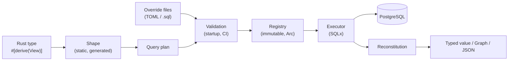
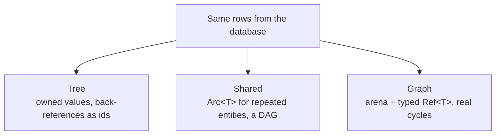
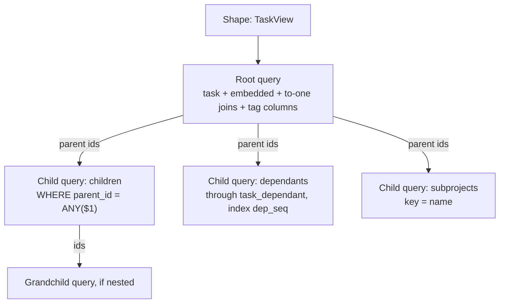
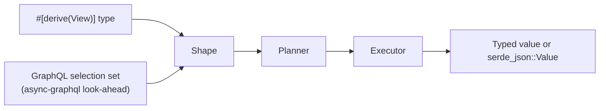

# Mabat design

| | |
| --- | --- |
| Status | Draft, for discussion. M1 implemented; see the notes marked **M1** |
| Author | Dilip Dalton |
| Created | 2026-10-07 |
| Lineage | Rust successor to the ideas in [XOR](https://github.com/ddalton/xor) (Java) |

> The contract of what was built is the [MPA specification](mpa.md); this document is the design and its
> reasoning.

## Contents

1. [Summary](#1-summary)
2. [Motivation](#2-motivation)
3. [Goals and non-goals](#3-goals-and-non-goals)
4. [Concepts](#4-concepts)
5. [Defining views](#5-defining-views)
6. [Algebraic data types](#6-algebraic-data-types)
7. [Recursion, sharing and cycles](#7-recursion-sharing-and-cycles)
8. [Query planning](#8-query-planning)
9. [Overrides: tuning without code changes](#9-overrides-tuning-without-code-changes)
10. [Execution and reconstitution](#10-execution-and-reconstitution)
11. [Transactions and concurrency](#11-transactions-and-concurrency)
12. [Errors](#12-errors)
13. [GraphQL and dynamic shapes](#13-graphql-and-dynamic-shapes)
14. [Writes](#14-writes)
15. [Crate layout](#15-crate-layout)
16. [Testing and benchmarks](#16-testing-and-benchmarks)
17. [Milestones](#17-milestones)
18. [Prior art](#18-prior-art)
19. [Risks](#19-risks)
20. [Open questions](#20-open-questions)

---

## 1. Summary

Mabat loads typed aggregates from a relational database. The shape of the result is declared with ordinary
Rust types: structs, enums, `Option`, `Vec`, maps and recursive types. Mabat plans and runs the queries that
fill that shape.

The query behind a view can be **replaced in configuration**, without code changes, by hand-tuned SQL written
by a DBA. Mabat checks every replacement against the Rust type at startup, so tuning can't silently corrupt
results.

Three things set it apart from existing Rust database crates:

- **Sum types are first class.** `enum Payment { Card { .. }, Bank { .. } }` maps to the database with a
  chosen strategy, and decoding is exhaustive and checked.
- **Cyclic and shared object graphs without `Rc`, `Weak` or `RefCell`.** A view picks a tree, a shared DAG,
  or an arena-backed graph with typed references.
- **Queries that are separate from the shape.** A view defines *what* is returned. The query that produces it
  can be generated, overridden, split or reordered without touching the application.

The name is the Hebrew word *mabat* (מבט), "a view": the library is built around views, the shape of the data
an application wants to see, independent of the queries that produce it.

## 2. Motivation

### 2.1 The problem XOR solved

In an ORM-based application the slow part is usually turning the object model into SQL. The ORM decides join
order, fetch strategy and N+1 behavior, and fixing a slow query means changing code. XOR introduced the
**view**: a named shape of data that application code asks for, whose underlying query can be swapped in XML
for user OQL, native SQL or a stored procedure. A DBA could tune production queries without a release.

Building XOR also showed where that design goes wrong. The most important lessons:

| Lesson from XOR | Consequence for Mabat |
| --- | --- |
| Native query columns were mapped by position, so swapping two same-typed columns silently corrupted data | Columns are mapped **by name**. Mapping by position is an explicit opt-in |
| Configuration errors appeared only when a query ran | Every override is checked **at startup** and in CI |
| List order depended on the row order the SQL returned | Elements are placed by an index column, whatever order the rows arrive in |
| Global mutable state: a cached model one operation could corrupt for the next, and a static parallel switch | An **immutable registry** built once. Options are passed per call |
| Parallel child queries ran on other connections and couldn't see the caller's transaction | Child queries run **on the caller's transaction** by default |
| Exceptions were wrapped but not thrown | `Result` everywhere. Errors name the view, the path and the SQL |
| SQL was rewritten with string surgery | Generated SQL is built as an AST. Override SQL is opaque and only has its placeholders bound |

### 2.2 The gap in Rust

| Crate | What it does | What's missing for this use case |
| --- | --- | --- |
| Diesel | Type-safe query builder; `Queryable`/`Selectable` structs | Flat rows; no aggregates, sum types or runtime-swappable SQL |
| SeaORM | Async ORM over SeaQuery; relations and partial models | Relations loaded per entity; no sum-type mapping; no override workflow |
| SQLx | Async driver; `query_as!` checked at compile time | SQL lives in code; flat `FromRow`; nested results are hand-written |
| cornucopia / clorinde | Generates Rust from `.sql` files at build time | SQL is fixed at build time; flat results |

None of them loads a nested, typed aggregate that includes enums with data and cycles, from queries a DBA can
replace in production.

### 2.3 Ownership and cyclic graphs

A relational schema is a graph. Task has a parent and children, and person and project reference each other.
Holding a cyclic graph in Rust usually means `Rc<RefCell<T>>` with `Weak` back-references, which costs runtime
borrow checks and is easy to get wrong. A data-loading crate gets to choose how results are represented, so
it can pick representations Rust handles well (section 7) instead of forcing pointers onto the graph.

## 3. Goals and non-goals

### Goals

- **G1.** Declare the shape of a read with Rust types, using a derive macro.
- **G2.** Support products (structs), sums (enums with data), `Option`, `Vec`, `BTreeMap`/`HashMap`, and
  recursive types.
- **G3.** Load an aggregate with a few batched queries and no N+1 problem.
- **G4.** Let each view's query be replaced from configuration, and check every replacement at startup and in CI.
- **G5.** Represent shared and cyclic data safely without `Rc`/`Weak`/`RefCell`.
- **G6.** Async, built on SQLx. PostgreSQL first.
- **G7.** Match hand-written SQLx performance for the same SQL (decoding overhead within about 10%).
- **G8.** Return the same view as typed values or as JSON, so it can back a GraphQL or REST API.

### Non-goals

- **Replacing an ORM for writes.** Writes are optional and limited (section 14).
- **Schema migrations.** Use existing tools such as sqlx-cli, refinery or atlas.
- **Compile-time checking of override SQL.** Overrides change at runtime by design; they're checked at
  startup and in CI.
- **Inheritance.** Rust has none. Sum types and composition cover the same modeling needs.
- **A query language of its own.** Filtering covers comparisons, lists, patterns and boolean groups on the
  root table; anything else is override SQL.

## 4. Concepts

| Term | Meaning |
| --- | --- |
| **View** | A Rust type that derives `View`. It's the contract for the shape of the data |
| **Shape** | The runtime representation of a view, generated by the derive macro: a tree of product, sum, collection, optional and scalar nodes |
| **Path** | The address of a value inside a shape, such as `name`, `children.name`, `status.Blocked.reason` or `status.$tag` |
| **Query plan** | The tree of queries that fills a shape. Each query fills a subtree, and child queries are joined to parents by key |
| **Override** | Replacement SQL for one query in a plan, supplied in configuration |
| **Registry** | The immutable set of views, plans and validated overrides built at startup |
| **Representation** | How the result is held in memory: tree, shared or graph (section 7) |



## 5. Defining views

### 5.1 A first view

```rust
use mabat::{View, Ref};
use uuid::Uuid;

#[derive(View, Debug)]
#[view(table = "task")]
pub struct TaskView {
    pub id: Uuid,
    pub name: String,
    pub description: Option<String>,

    // to-many child collection, loaded by a child query
    #[view(child(fk = "parent_id"))]
    pub children: Vec<TaskSummary>,

    // ordered list: elements are placed by the index column, whatever the row order
    #[view(child(through = "task_dependant", fk = "task_id", target = "dependant_id", index = "dep_seq"))]
    pub dependants: Vec<TaskSummary>,

    // map keyed by a column
    #[view(child(fk = "project_id", key = "name"))]
    pub subprojects: std::collections::BTreeMap<String, ProjectSummary>,

    // to-one: LEFT JOIN by default, or a child query when it is large
    #[view(to_one(fk = "assignee_id"))]
    pub assignee: Option<PersonSummary>,

    pub status: Status, // a sum type, see section 6
}

#[derive(View, Debug)]
#[view(table = "task")]
pub struct TaskSummary {
    pub id: Uuid,
    pub name: String,
}
```

### 5.2 Loading

> **M1:** loading is the free function `mabat::load::<T>()`, with `by_key`, `by_keys`, `order_by`,
> `order_by_desc`, `limit` and `offset`, run with `all`, `one` or `optional` on a `&mut PgConnection`.
>
> **Filters:** filters use a small API of Mabat's own, `mabat::filter`, not SeaQuery.
>
> - **Why not SeaQuery:** a SeaQuery expression renders its own placeholders and needs its own SQLx binder,
>   which may not support SQLx 0.9 yet, while the keys are already bound as `$1`.
> - **The API:** `col(..)` builds `eq`, `ne`, `lt`, `le`, `gt`, `ge`, `is_null`, `is_not_null`, `is_in`,
>   `not_in`, `like` and `ilike` conditions. They combine with `and` (`&`), `or` (`|`), `!`,
>   `Condition::all` and `Condition::any`. Several `filter` calls are all applied.
> - **Binding:** values are bound after the keys. A list is bound as one array (`= ANY($n)`), so the
>   statement is the same for any length, and an empty list is a constant.
> - **Columns:** filters name columns of the view's table, like `order_by`. With an override of the root
>   query, they are applied to the override as a subquery and refer to the columns the view selects.
> - **Counting:** `count()` runs `SELECT count(*)` with the same keys and filters, ignoring ordering and
>   paging.
> - **Scope:** filters apply to the root query only; filters on child collections come with GraphQL field
>   arguments (section 13).
>
> **M3:** the registry takes no pool. `build(&mut conn)` checks the views on the connection it is given and
> returns an immutable `Mabat`; every load still takes its own connection or transaction. The free function
> `mabat::load` remains for loading with the generated queries only.

```rust
let mabat = Mabat::builder()
    .pool(pool)                                  // sqlx::PgPool
    .register::<TaskView>()
    .overrides_dir("mabat/overrides")          // optional, section 9
    .build()
    .await?;                                     // validates the overrides

// by key
let task: TaskView = mabat.load::<TaskView>().by_key(task_id).one(&mut tx).await?;

// with a filter on the root
let open: Vec<TaskView> = mabat
    .load::<TaskView>()
    .filter(col("status_kind").eq("open"))
    .order_by("name")
    .limit(50)
    .all(&mut tx)
    .await?;
```

### 5.3 Attributes

| Attribute | On | Meaning |
| --- | --- | --- |
| `table = "..."` | struct | Root table of the view |
| `key = "id"` | struct | Primary key column(s); defaults to `id` |
| `column = "..."` | field | Column name when it differs from the field name |
| `child(fk, through, target, index, key, order_by, depth, recursive)` | `Vec`/map field | To-many relationship loaded by a child query; `depth = n` or `recursive = "cte"` for a recursive collection |
| `to_one(fk, strategy = "join" \| "query")` | field | To-one relationship |
| `tag = "..."`, `strategy = "..."` | enum | Sum type mapping (section 6) |
| `depth = n` | inside `child(..)` | Maximum depth for a recursive view (section 7.1) |
| `json` | field | Decode the column with `serde` |
| `representation = "tree" \| "shared" \| "graph"` | struct | In-memory representation (section 7) |

Attribute errors, such as a missing `fk` or an `index` on a field that isn't a `Vec`, are reported at compile
time by the macro.

## 6. Algebraic data types

### 6.1 Products

Structs and tuple structs are product types. Nested structs without a `child`/`to_one` attribute are
**embedded**: their fields come from the same row, with an optional column prefix.

```rust
#[derive(View)]
#[view(embedded(prefix = "addr_"))]
pub struct Address { pub street: String, pub city: String }
```

### 6.2 Sums

Each enum chooses a mapping strategy:

| Strategy | Schema | Good for |
| --- | --- | --- |
| `tag` (default) | A tag column plus nullable columns per variant in the same table | Small enums |
| `table_per_variant` | A tag column; each variant's data in its own table, keyed by the parent key | Variants with many or distinct fields |
| `json` | One JSONB column, decoded with `serde` | Rarely filtered, highly variable data |

```rust
#[derive(View, Debug)]
#[view(tag = "status_kind")]                     // strategy = "tag"
pub enum Status {
    #[view(tag_value = "open")]
    Open,
    #[view(tag_value = "assigned")]
    Assigned { assignee: String },
    #[view(tag_value = "blocked")]
    Blocked { reason: String, since: chrono::DateTime<chrono::Utc> },
}

#[derive(View, Debug)]
#[view(tag = "kind", strategy = "table_per_variant")]
pub enum Payment {
    #[view(table = "card_payment")]
    Card { last4: String, network: Network },
    #[view(table = "bank_payment")]
    Bank { iban: String },
    #[view(table = "voucher_payment")]
    Voucher(VoucherDetails),                     // tuple variant holding a product
}
```

> **M2:** as implemented:
>
> - **Marking enum fields:** a field holding an enum is marked `#[view(embed)]`, like an embedded struct,
>   optionally with a column `prefix` for the tag and the variant columns. The struct's derive can't tell
>   an enum from a column type, so the attribute is needed.
> - **Tags:**
>   - The tag column is selected as `text`, so it can be a text column, a PostgreSQL enum or a number.
>   - `tag_value` defaults to the variant name.
>   - Two variants with the same tag value are a compile error.
> - **`json`:** a field attribute that works for any `serde` type, not a strategy of enums.
> - **`table_per_variant`:**
>   - Each variant with data is a view of its own table, named `Enum::Variant`. Its key column (`key`,
>     `id` by default) holds the key of the containing view.
>   - Its fields can be child collections and to-one references.
>   - It needs to be a direct field of a view, not nested in an embedded struct or another enum.
>   - Variants stored in columns can't hold child collections or references; the macro says to use
>     `table_per_variant`.
> - **Not supported yet:**
>   - `Option<Enum>` fields. A unit variant can stand for "none".
>   - `#[view(variant_fetch = "join")]` (section 6.5): variant tables are always loaded by queries.

### 6.3 Paths for sum types

Variant fields have paths that name the variant explicitly, which keeps alias-based mapping unambiguous:

| Path | Value |
| --- | --- |
| `status.$tag` | The discriminator |
| `status.Assigned.assignee` | Field of the `Assigned` variant |
| `payment.Voucher.0.code` | A field inside a tuple variant |

### 6.4 Decoding rules

- Decoding is an exhaustive `match` on the tag, generated by the macro.
- An **unknown tag value** is an error, not a default.
- A **non-null column that belongs to a different variant** than the tag is an error by default (`strict`), or
  ignored when the enum is marked `#[view(lenient)]`. This catches a broken override or inconsistent data.
- A unit variant needs only the tag.
- Nested sums (`enum A { X(B) }` where `B` is an enum) compose: each level has its own `$tag` path.

> **M2:** the columns that must be NULL for a variant are the columns of the other variants, without the
> columns it shares with them (two variants can map a field to the same column). A nested enum's columns
> belong to the variant that contains it. With `lenient`, nothing is checked. Columns an override doesn't
> select aren't checked either.

### 6.5 Planning for `table_per_variant`

The planner either LEFT JOINs every variant table (few variants, small rows), or runs one child query per
variant that is present, keyed by the parent ids that have that tag. Statistics or an attribute
(`#[view(variant_fetch = "join" | "query")]`) choose between them.

> **M2:** only the query strategy is implemented. Each variant table is a child query named after the
> variant's path, such as `payment.Card`, so it can be overridden, including with a join. It runs only
> for the keys of rows whose tag names the variant, and not at all when no row does.

## 7. Recursion, sharing and cycles

A relational schema is a graph, while the most convenient Rust value is a tree. Mabat makes the
representation an explicit, per-view choice.



### 7.1 Tree (the default)

A view is a finite unrolling of the graph. Edges that point back become ids.

```rust
#[derive(View)]
#[view(table = "task")]
pub struct TaskTree {
    pub id: TaskId,
    pub name: String,
    pub parent: Option<TaskId>,                  // back-reference as an id
    #[view(child(fk = "parent_id"), depth = 5)]
    pub children: Vec<TaskTree>,                 // recursive, owned
}
```

A recursive view needs either a `depth` limit or `recursive = "cte"`. In the second case the planner issues a
single `WITH RECURSIVE` query and builds the tree from `(id, parent_id, depth)` rows.

> **M4:** both modes are implemented. `depth` and `recursive` go inside `child(..)`, such as
> `#[view(child(fk = "parent_id", depth = 5))]`.
>
> - **`depth = n`:**
>   - The plan stays finite: when a collection leads back to a view whose query it already entered, the
>     child repeats that query (`ChildQuery::Repeat`) instead of planning it again.
>   - At run time, each level runs the same query with the keys of the level above. It stops at `n` levels,
>     or when a level is empty.
>   - This also covers cycles through several views (A → B → A), with the annotation on any collection of the
>     cycle.
> - **`recursive = "cte"`:**
>   - One `WITH RECURSIVE` query selects the keys of all levels, each row once, then their columns. Its
>     recursive field reads the next level from the same rows (`ChildQuery::Same`). An optional `depth`
>     limits the levels.
>   - Collections below the recursive view load with one query for all levels.
>   - The CTE carries the path of keys, so the recursion in the database stops at cycles in the data.
>   - If the loaded rows' parents still form a cycle, loading fails with `Error::Cycle` rather than looping
>     forever. A tree can't hold a cycle; that is M5's graph representation.
>   - It needs a collection that contains its own view directly, without `through`. Use `depth` otherwise.
> - **Unannotated cycles:** a cycle without an annotation fails to plan, with a hint.
> - **Overrides:** every level of a recursive collection has the query name of its first level, so one
>   override applies to all levels.

### 7.2 Shared

Results are read-only, so an identity map can return `Arc<T>` for entities reached by more than one path.
Without cycles this needs no `Weak` and no `RefCell`.

```rust
#[derive(View)]
#[view(table = "task", representation = "shared")]
pub struct TaskShared {
    pub name: String,
    #[view(to_one(fk = "assignee_id"))]
    pub assignee: Arc<PersonSummary>,            // one allocation per person
    #[view(to_one(fk = "reviewer_id"))]
    pub reviewer: Option<Arc<PersonSummary>>,
}
```

If the shape contains a cycle, the derive macro rejects `representation = "shared"` and suggests `graph`.

> **M5:** there is no `representation` attribute.
>
> - **Selecting it:** the field type chooses: `Arc<T>`, `Option<Arc<T>>` or `Vec<Arc<T>>`.
> - **Identity:** values are shared per load by view type and key, across fields and collections. A person who
>   is both the assignee and the reviewer, or on two projects, is one allocation.
> - **Cycles:** a cycle of `Arc` fields fails to plan like any unannotated cycle.

### 7.3 Graph

For genuinely cyclic models, the result is a `Graph`: one arena per entity type, with relationships stored as
typed indices.

```rust
#[derive(View)]
#[view(table = "task", representation = "graph")]
pub struct Task {
    pub name: String,
    #[view(to_one(fk = "parent_id"))]
    pub parent: Option<Ref<Task>>,
    #[view(child(fk = "parent_id"))]
    pub children: Vec<Ref<Task>>,
    #[view(to_one(fk = "assignee_id"))]
    pub assignee: Ref<Person>,
}

let g: Graph = mabat.load::<Task>().by_key(root_id).graph(&mut tx).await?;

let root = g.root::<Task>();
for child in root.children(&g) {                 // generated: impl Iterator<Item = &Task>
    let parent = child.parent(&g).unwrap();      // follows the cycle back to the root
    println!("{} <- {} ({})", parent.name, child.name, child.assignee(&g).name);
}
```

Properties:

- `Ref<T>` is `Copy`, `Eq` and `Hash`, and stores an index together with the graph's id, so a ref used with the
  wrong graph is caught in debug builds.
- Navigation borrows `&Graph`. There are no runtime borrow checks.
- Mutation goes through `&mut Graph` (`g.get_mut(r)`), which also records changed entities for writes
  (section 14).
- `Graph` is `Send + Sync` and can be shared with `Arc<Graph>` across tasks.
- JSON serialization writes `$id`/`$ref`, or unrolls the graph to a chosen depth (section 13).

Loading a graph uses the same planner. Each entity type is loaded with batched queries, and every `Ref` is
resolved through the identity map, so cycles cost nothing extra.

> **M5:** as implemented:
>
> - **Selecting it:** the field types choose: `Ref<T>`, `Option<Ref<T>>` and `Vec<Ref<T>>`, with no
>   `representation` attribute.
> - **Loading:**
>   - A view with references is loaded with `.graph(conn)`, which returns `Graph<R>` with the matching rows
>     as roots. `.all()` fails with `Error::GraphRequired`.
>   - The graph holds every entity reachable through references. A cycle through a reference needs no
>     `depth`: it plans as a repeated query, and the load fetches each entity once (a to-one query skips keys
>     already fetched) and expands each collection of an entity once.
>   - A row of an entity fetched before is a duplicate. It isn't decoded again and its fields aren't loaded
>     again. Owned values inside entities keep tree semantics.
> - **Decoding:**
>   - Edges are recorded while loading, then each entity is decoded once into the arena of its type.
>   - A `Ref` is an arena index allocated by key, so an entity can be referenced before it is decoded.
>   - Owned values inside entities, such as `Vec<Note>` where `Note` has a `Ref<Employee>`, are decoded as
>     trees, and their references are part of the graph.
> - **API:**
>   - `Graph`: `roots()`, `root()`, `root_refs()`, `get(r)`, `get_mut(r)`, `all::<T>()` and `count::<T>()`.
>   - A `Ref` used with another graph panics.
>   - The derive generates a navigation method per reference field, named after it: `parent(&g)`,
>     `children(&g)`.
> - **Not done yet:**
>   - JSON with `$id`/`$ref`, which comes with GraphQL (section 13).
>   - Recording changes for writes (section 14).
>   - References inside variant tables.

## 8. Query planning

### 8.1 From shape to plan



Rules:

1. The root query selects the root table, embedded structs, `to_one(strategy = "join")` relationships and sum
   columns for the `tag` strategy.
2. Each to-many relationship becomes a child query keyed by the parent keys collected from the parent's
   results. This avoids both N+1 queries and the cartesian blow-up of joining collections.
3. On PostgreSQL, child queries bind the parent keys as an array: `WHERE fk = ANY($1)`. Other databases use
   batched `IN` lists sized to the database's limit.
   **As built (MySQL and SQLite):** keys are bound as `IN (?, …)`, padded to a power of two by repeating the last key, so
   a few statements serve every count, and split into statements of at most 1,000 keys for child queries. The
   root query is never split, since that would break its ordering and paging. Override SQL writes `:keys`,
   which becomes `$1` or the list of parameters. Text keys are grouped by exact value, so on MySQL, whose
   default collations compare case-insensitively, a foreign key must match its key's case.
4. Queries at the same depth are independent and can run concurrently (section 11).
5. Generated SQL is built from an AST, never by editing strings.
   **As built:** a small internal renderer (`mabat_core::sql`) builds the statements from the plan and the
   filter tree (`mabat_core::filter`), with every identifier quoted and every value bound. Mabat needs
   only SELECT, `= ANY($n)`, simple conditions, ORDER BY, LIMIT, OFFSET and `count(*)`, so it doesn't depend
   on SeaQuery.
6. Every selected column gets an alias equal to its path. The key column is selected once: under the alias of
   the field that holds it, or as `$key` if no field does. Generated queries and override queries are therefore
   decoded the same way.

### 8.2 Plan inspection

```rust
let plan = mabat.plan::<TaskView>();
println!("{}", plan.explain());       // the query tree with SQL and the paths each query fills
plan.write_mermaid("plan.mmd")?;      // diagram for docs or reviews
```

## 9. Overrides: tuning without code changes

### 9.1 Format

Overrides live in a directory, one file per view, either TOML or plain SQL with a header. Each query in the
plan is addressed by its path (`$root`, `children`, `dependants`, ...).

```toml
# mabat/overrides/TaskView.toml
[query."$root"]
sql = """
SELECT t.id                AS "id",
       t.name              AS "name",
       t.description       AS "description",
       t.status_kind       AS "status.$tag",
       t.assignee          AS "status.Assigned.assignee",
       t.blocked_reason    AS "status.Blocked.reason",
       t.blocked_since     AS "status.Blocked.since",
       p.id                AS "assignee.id",
       p.name              AS "assignee.name"
FROM task t
LEFT JOIN person p ON p.id = t.assignee_id
WHERE t.id = ANY($1)
"""

[query.dependants]
# any join order and sort; elements are placed by "dependants.$index"
sql = """
SELECT td.task_id   AS "$parent",
       td.dep_seq   AS "$index",
       d.id         AS "id",
       d.name       AS "name"
FROM task_dependant td JOIN task d ON d.id = td.dependant_id
WHERE td.task_id = ANY($1)
"""
```

System columns:

| Alias | Meaning |
| --- | --- |
| `$parent` | Parent key, used to attach child rows to their parent |
| `$index` | List index, used to place elements |
| `$key` | Map key |
| `<path>.$tag` | Sum type discriminator |

> **As built:**
>
> - **`$key`:** it is the key of the selected entity, used when no field holds the key (M1).
> - **`$map_key`:** the map key column is selected as `$map_key` (M4).
> - **`$index`:** it must be an integer column.
> - **`$ref.<field>`:** it holds the foreign key of a to-one reference.

> **M3:** a query is addressed by its name: `$root`, or the path of the field the query fills, such as
> `children.notes`. Both formats are implemented:
>
> - **TOML:** `TaskView.toml`, with a `[query."<name>"]` table per query.
> - **SQL:** `TaskView.sql`, with a `-- mabat: query <name>` line before each query, optionally followed by
>   `, shadow`. Each query may end with `;`, so the file can be run in `psql` as is.
>
> A view has at most one override file. `mabat::scaffold::<T>()` writes a TOML file with the generated SQL of
> every query.

### 9.2 Contract

- Parameter `$1` is always the array of parent keys (or root keys). Named filters from the call site are
  passed as `$2..` and declared in the file.
- Every column must have an alias that is a path in the shape, or a system column.
- Every non-optional path in the subtree must be covered.
- Column types must be compatible with the Rust field types.

> **M3:** as implemented:
>
> - **Root query:** it takes either no parameter or the array of root keys as `$1`. Without a parameter, it is
>   used as a subquery, which `by_keys`, `order_by`, `limit` and `offset` filter, order and page. `order_by`
>   then refers to columns the view selects, as do filters, whose values are bound after the keys. With `$1`,
>   the load needs `by_key` or `by_keys`.
> - **Other queries:** they take the array of the keys they are selected by as `$1`.
> - **Key columns:** they must hold integer, text or uuid values. A `$parent` column must hold the same kind of
>   key as its parent, and a referenced view's key the same kind as the reference.
> - **`Option` fields:** an `Option` path may be left out. It is then always `None`, and the check warns
>   (`M0105`).
> - **Nullability:** it is not checked, because a prepared statement does not report it. A `NULL` in a
>   non-`Option` field fails when it is decoded, with the path of the field.

### 9.3 Validation

At startup, and with `mabat check` in CI, Mabat:

1. prepares each override statement on the database (`sqlx::Executor::prepare`) without running it,
2. reads the column names and types from the prepared statement,
3. checks every alias against the shape, checks coverage and type compatibility,
4. fails with a report listing every problem in every view.

```text
error[M0102]: override for TaskView.$root does not match the view
  --> mabat/overrides/TaskView.toml:3
   | column 5 "status.Blocked.reasn" is not a path in TaskView (did you mean "status.Blocked.reason"?)
   | path "status.Blocked.since" is not covered
   | column 2 "name" has type INT4, expected TEXT for String
```

The failure policy is configurable per environment: refuse to start (the default), or log the error and fall
back to the generated query.

> **M3:**
>
> - **Generated queries:** they are checked as well, so schema drift is found at startup. A problem with a
>   generated query that a valid override replaces is only a warning.
> - **Fallback:** `OnInvalid::UseGenerated` falls back only for invalid overrides. A broken generated query or
>   a view that cannot be planned always fails.
> - **Transactions:** each statement is prepared in a transaction, or a savepoint inside the caller's, that is
>   rolled back, so checking does not abort a transaction.
> - **CI:** the application can run `Mabat::builder()...check(&mut conn)` as a test.
>
> **DBA tooling:**
>
> - **The manifest:** a binary can't know the application's view types, so the application writes a
>   *manifest* (`Builder::manifest()`, JSON) of every query of its views, with:
>   - name, link and generated SQL
>   - the aliases and their roles
>   - the PostgreSQL type names each field accepts, computed from SQLx's own compatibility rules when the
>     manifest is written
> - **One checker:** the startup check runs on the same manifest, so the application and the tool report the
>   same problems.
> - **The `mabat` tool** (crate `mabat-cli`) runs `check`, `explain` and `scaffold` on a manifest with no
>   Rust toolchain.
> - **`check --schema file.sql`:** creates the schema in a temporary schema inside a transaction that is
>   rolled back, so a DBA can check overrides against any scratch database.
>
> Diagnostic codes:
>
> | Code | Problem |
> | --- | --- |
> | `M0100` | An override file could not be read or parsed |
> | `M0101` | A file or query does not address a registered view or query |
> | `M0102` | Columns do not match the view |
> | `M0103` | The statement does not prepare |
> | `M0104` | Wrong parameters |
> | `M0105` | An optional path is not selected (warning) |
>
> Checking against a schema snapshot (`mabat check --snapshot`, no database) adds `M0201`–`M0207`: missing
> tables and columns, column types the fields cannot be decoded from, nullable columns under fields that are not
> `Option` (warning), mismatched link keys, keys that are not primary keys (warning), and generated keys the
> database does not generate. The snapshot's types are named as SQLx names them, as the manifest's accepted types
> are, so the comparison is the one `check` makes on a prepared statement.

### 9.4 Shadow mode

`shadow = true` on an override runs both the override and the generated query, compares the decoded results,
and records timings and mismatches as `tracing` events and metrics. This lets a DBA prove a tuned query is
equivalent before switching to it.

> **M3:**
>
> - **How rows are compared:** the comparison works on rows, not decoded values, using the encoded value of
>   every column the override selects:
>   - to-many rows in order per parent,
>   - other rows by key.
> - **Where results go:** a mismatch is a `tracing` warning, and `Mabat::shadow_stats()` returns runs,
>   mismatches and the total time of each query. The override's rows are used.
> - **Known gap:** shadow mode is the only check that catches two columns of the same type swapped in an
>   override.

### 9.5 Reloading

With the `reload` feature, override files are watched. A changed file is validated first, and only then
swapped into the registry atomically (`ArcSwap`). An invalid change never replaces a working query.

> **M3:** reloading is always available, with no feature flag, and the application triggers it:
>
> - **Triggering:** `Mabat::reload(&mut conn)` reads the files again. It returns `Reloaded::Unchanged` when
>   they are the same as at the last attempt, so it is cheap to call on a timer, on `SIGHUP` or from an admin
>   endpoint. Mabat does not watch files itself, which would need a file watcher and a connection pool of
>   its own.
> - **All or nothing:** a reload with any error changes nothing and returns the report, whatever `OnInvalid`
>   is.
> - **Running loads:** a load that is running keeps the overrides it started with.
> - **Shadow statistics:** they are kept for overrides whose SQL did not change.

## 10. Execution and reconstitution

1. Run the root query and decode each row into a partial value plus its key.
2. For each child query, bind the collected keys, run it, and group the rows by `$parent` in a hash map.
3. Attach the children:
   - `Vec`: in `$index` order when an index is declared, otherwise in row order. Duplicate rows (identity) are
     collapsed.
   - Maps: keyed by `$key`. A duplicate key is an error.

   > **M4:**
   >
   > - **Lists:** elements are sorted by `$index` within each parent; a duplicate or NULL index is an error.
   >   Duplicate rows aren't collapsed: a many-to-many list may hold the same element twice.
   > - **Maps:** `BTreeMap` or `HashMap`, keyed by `$map_key`.
   - `Option`: at most one row. More than one is an error.
4. For the graph representation, entities are inserted into their arena through the identity map, and `Ref`s
   are resolved after all queries finish.

The derive macro generates the decoder: a `match` over column positions resolved once per statement from the
aliases. Per row, decoding is plain indexed access with no hashing of names.

> **M1:** field columns are decoded by alias through SQLx (`Row::try_get(&str)`), the same lookup hand-written
> SQLx code uses. Key columns are resolved once per query result. With this, loading 1,000 tasks with 10
> subtasks each takes about 8% longer than hand-written SQLx running the same queries
> (`crates/mabat/examples/parity.rs`). Positional decoding is the next optimization.

Large results can be streamed: `.stream()` yields root values once the child queries for each batch of roots
have finished. Roots are processed in batches of a configurable size.

## 11. Transactions and concurrency

- Every load takes an executor: `&mut PgConnection` or `&mut Transaction`. All queries of a plan run on it by
  default, so they see the caller's uncommitted writes and a consistent snapshot.
- On a single connection, independent child queries are **pipelined** where the driver supports it, rather
  than run on other connections.
- `.concurrency(Concurrency::Pool(n))` runs independent queries on up to `n` pooled connections. It's allowed
  only with `REPEATABLE READ` / read-only snapshot semantics (exported snapshots on PostgreSQL), or when the
  caller explicitly accepts reading committed data only.
- There's no global state. The registry is immutable and options are per call.

> **As built:**
>
> - **The API:** `Pooled::snapshot(&pool, n)` and `Pooled::read_committed(&pool, n)` are passed where a load
>   takes a connection (`.all(&mut pooled)`), rather than set with `.concurrency(..)`, so every terminal, count,
>   check and registry accepts them.
> - **Snapshots:** the first connection begins `REPEATABLE READ READ ONLY` and exports its snapshot with
>   `pg_export_snapshot()`; the others import it with `SET TRANSACTION SNAPSHOT`. `snapshot` is only defined
>   for PostgreSQL pools, so asking for one on MySQL or SQLite does not compile. The transactions are rolled
>   back at the end, or when the load is dropped.
> - **Scheduling:** the child queries of a level run together with `try_join_all`, each on a connection held
>   for that query only, so a load needs no more than `n` connections and cannot deadlock on its own pool.
>   Keys are collected from the rows above before the queries of the level start.
> - **Graphs** run their queries one at a time on one connection: which query fetches an entity first decides
>   where its row is, and that stays the same from run to run.
> - **Pipelining** on one connection is not done: SQLx 0.9 has no pipelining API.
>
> **Streaming (`Load::stream`):** one query reads the keys of every matching root, with the filter, order and
> page (`sql::keys`), then each batch of keys runs the by-keys path, root and child queries, and the batch's values
> are put back in the order of the keys. The stream keeps one `Runner` for its whole life, so a `Pooled::snapshot`
> snapshot spans every batch, and on one connection a `REPEATABLE READ` transaction does. Holding the key list
> rather than a server-side cursor works the same way on every database; a PostgreSQL cursor over the root query
> could avoid the key list later.

## 12. Errors

All errors are `mabat::Error`, using `thiserror`, and carry the view, path and SQL involved.

| Code | When |
| --- | --- |
| `M01xx` | Override validation (unknown alias, missing path, type mismatch) |
| `M02xx` | Decoding (unknown tag, column of another variant, duplicate map key, multiple rows for `Option`) |
| `M03xx` | Planning (cycle without `graph` representation, recursive view without `depth` or `cte`) |
| `M04xx` | Execution (SQLx errors, wrapped with context) |

Nothing is swallowed. Lenient behaviors (such as `#[view(lenient)]`) are opt-in and logged.

> **As built:** decoding, planning and execution errors are variants of `mabat::Error` (`Decode`, `Plan`,
> `Query`, …), not codes. Codes are used by the diagnostics of checks: `M01xx` for overrides, `M02xx` for checks
> against a schema snapshot (`M0201`–`M0207`), and `M0301` for a view that cannot be planned.

## 13. GraphQL and dynamic shapes

Typed views are compiled in, while a GraphQL selection set is only known at runtime. Both go through the same
core:



- `mabat-graphql` turns an `async-graphql` look-ahead into a **sub-shape** of a registered view. Only the
  selected fields are queried, and only the needed child queries run.
- Overrides still apply: when a sub-shape is covered by an override, the override is used and its unselected
  columns are ignored.
- Output for GraphQL is a tree. Cycles are unrolled to the depth the query asks for, so the graph
  representation isn't needed.
- Arguments on fields (filters, paging) map to child query filters.

> **As built (first part):**
>
> - **Selections:** `mabat_core::Selection` is a tree of field names, built in code or parsed from GraphQL-like
>   text. `QueryPlan::build_selected` plans only the selected columns and child queries, plus the key column. A
>   view selected without fields loads its columns and embedded values, but not its collections and
>   references, so every selection has a finite depth. Embedded structs and enums are loaded whole.
> - **Recursion and graphs:** a selection disables cycle detection, recursion and graph handling below it:
>   each selected level is a query, and references into a graph are loaded as values.
> - **JSON:** the derive generates `decode_json` next to `decode`. A column is written with its Rust type's
>   `Serialize`, chosen at compile time by autoref specialization, so views whose column types do not
>   implement it still compile and only fail when such a column is loaded as JSON. Enums are objects with a
>   `__typename` field, tuple fields are `_0`, `_1`, …
> - **Overrides** apply to selected plans as to whole ones: queries are found by path, and decoding by alias
>   ignores the columns a selection does not use.
>
> **As built (second part):**
>
> - **The schema is generated** (open question 5): `mabat-graphql` builds an async-graphql dynamic schema from
>   the shapes of the views given as root fields and every view they reach. `#[derive(View)]` records the Rust
>   type of each column (`ValueType`) for the scalar types and the filters.
> - **Types:** views and embedded structs are objects, enums with data are unions of an object per variant
>   with a `_variant` field (GraphQL objects need a field, and unit variants have none), enums without data are
>   GraphQL enums, and maps are lists of `{ key, value }`. Field names are the Rust names.
> - **Resolution:** a root field turns its selection set, with fragments resolved, into a `Selection` and runs
>   one JSON load; the field resolvers below read the JSON objects. Embedded values are selected whole.
> - **Arguments:** `where` filters the columns of the root view, `orderBy` sorts by them, and `limit` and
>   `offset` page. Nested lists take the same arguments: `Load::nested` gives a to-many child query a filter
>   after its keys condition, an order that replaces the collection's, and a page per parent with
>   `ROW_NUMBER() OVER (PARTITION BY fk ORDER BY …)`. An override of the query is wrapped as a subquery,
>   referring to columns by their aliases. Arguments are keyed by the query's name, so the levels of a
>   depth-limited recursive collection share them; a selection gives each level a name of its own.

## 14. Writes

Writes are a later, optional milestone. The scope is deliberately small:

- Insert and update **one aggregate by view**, using the same shape: product columns, `tag`-strategy sums
  (write the tag and the variant's columns, null the others), `table_per_variant` (upsert the variant row,
  delete the others), and child collections (diff by key, then insert, update or delete).
- For graphs: `&mut Graph` records changed entities. Saving orders the writes by the foreign-key dependency
  graph, using strongly connected components (Tarjan). Within a cycle it inserts with nullable foreign keys left
  null and patches them afterwards, all in one transaction. This follows XOR's approach.
- Optimistic locking through an optional version column.

Writes never go through override SQL. Overrides are for reads.

> **As built (first part):**
>
> - **The API** is `mabat::save(&value, conn)` and `mabat::delete::<T, _>(key, conn)`, in a transaction, or a
>   savepoint in the caller's. Statements run when they are called: there is no session to flush.
> - **The derive generates `ViewEncoder` and `EmbeddedEncoder`** next to the decoders: a `RowWrite` per row,
>   with the rows of owned collections, the links of many-to-many collections and the rows of variant
>   tables. Column types are written through `Encode`, JSON fields through `Serialize`, chosen by autoref
>   specialization, so views whose types cannot be written still compile and only fail when saved.
> - **Rows are upserted by key**, in the dialect's syntax. An owned collection selects the keys of its rows,
>   deletes those that are gone with what they own (deepest first), then saves the others with the parent's
>   key and, for ordered lists, their position. A many-to-many collection replaces its links. A to-one
>   reference writes its foreign key only. An enum in columns writes its tag as a literal, so any tag column
>   type accepts it, its variant's columns, and NULL to the other variants'.
> - **Not yet:** saving graphs in the order of their foreign keys. (Keys generated by the database came in the
>   third part, and graphs in the fourth.)
>
> **As built (second part):**
>
> - **`save_changes(&before, &mut after)`** builds the rows from a comparison generated by the derive:
>   columns and embedded values compared with `PartialEq` (or taken to differ, by autoref specialization),
>   to-one references by key, owned collections element by element, matched by key, and links as lists of
>   keys. Existing rows get `UPDATE … SET <changed>`, or no statement; new elements are saved whole; removed
>   ones are deleted with what they own, from `before`'s keys, with no `SELECT`.
> - **Optimistic locking:** a `#[view(version)]` field. A whole save runs `UPDATE … SET …, version = version + 1
>   WHERE key = ? AND version = ?`, then if no row matched, inserts the row unless one has the key (on MySQL,
>   `INSERT … SELECT … WHERE NOT EXISTS`, since `ON DUPLICATE KEY` counts a found row as affected); neither is a
>   conflict. An update that matches no row is a conflict. The new versions are written back through a
>   `Written` tree, which keys generated by the database will use too.
> - **Partial views:** a view of some of a table's columns cannot be saved whole when the others are `NOT NULL`
>   without a default, since the upsert must be able to insert; `save_changes` updates it. (Lifted later: `save`
>   now runs `UPDATE … WHERE key = ?` first and the upsert only if no row matched, as JPA's `merge` updates an
>   existing entity and inserts a new one, but without its `SELECT`. A partial view then fails only when its row
>   is new. SQLx connects to MySQL with `CLIENT_FOUND_ROWS`, so the count is of rows matched, not changed, and a
>   save that changes nothing is not taken for a new row.)
>
> **As built (third part):**
>
> - **Generated keys:** `#[view(generated)]` on the key field, an `Option` of an integer. A row whose key is
>   `None` is inserted without its key column, and the key is read back: `INSERT … RETURNING "id"` on
>   PostgreSQL and SQLite, the statement's `LAST_INSERT_ID()` on MySQL (`Backend::insert_generated`). Its owned
>   rows, links and variant rows are then written with that key; since the row is new, nothing it would own is
>   looked up or deleted first. The keys go back into the value through the `Written` tree, next to the
>   versions.
> - **New elements:** an element without a key is new, in `save` and in `save_changes` alike, so new tasks can
>   be added to a loaded project and saved with only what changed.
> - **Explicit keys still work:** a value with a key is upserted as before, so on PostgreSQL the column is
>   `GENERATED BY DEFAULT AS IDENTITY` (or `serial`), which accepts them, not `GENERATED ALWAYS`.
>
> **As built (fourth part):**
>
> - **`save_graph(&mut graph, conn)`** saves every entity of a graph. The derive records `Ref<T>` fields on the
>   `RowWrite` as references to entities (their type and arena index) instead of keys, and registers the entity
>   types that references lead to (`graph_types`), so the saver can write each arena without knowing its type.
> - **Order:** an entity depends on the entities its row references, on those whose collections write its
>   foreign key, and on those its owned values reference. The strongly connected components of these
>   dependencies (Tarjan) are saved in order, referenced ones first. Inside a cycle, the optional references
>   between its entities are written NULL and set by an `UPDATE` once the cycle is saved, and its entities are
>   saved in the order of their required references; required references alone in a cycle are an error. This
>   is the approach section 14 planned, after XOR.
> - **Collections of references:** through a link table, the entity's links are replaced. By a foreign key, the
>   collection is the inverse of the elements' reference by that column if they have one (as JPA's `mappedBy`),
>   and is checked to agree with it; otherwise it writes its elements' foreign key and position, and unlinks the
>   rows that are no longer elements by setting the key NULL.
> - **Not yet:** saving only what changed in a graph. `save_graph` writes every entity; a graph could record
>   what `get_mut` touched, as section 14 sketched.
>
> **As built (fifth part):**
>
> - **`save_all(&mut values, conn)`** writes many values as loads read them: statements per table and level of
>   the aggregate, not per row. The derive's rows keep owned copies of their bound values in batch mode (a
>   thread-local switch while `save_all` builds them), because SQLx cannot merge the arguments of separate
>   statements; a type that cannot be cloned makes the value fall back to `save`'s path, in the same
>   transaction.
> - **For each table:** one `UPDATE` from a table of values updates the rows that exist and returns their keys
>   (`RETURNING`); the others are inserted by one multi-row upsert, or a plain insert for versioned rows, whose
>   unique violation is a conflict. On PostgreSQL the table of values is cast to the column types, read once from
>   `pg_attribute`, because `VALUES` types its columns on its own: an all-NULL column becomes `text`, and `jsonb`
>   does not unify with `json`. MySQL cannot return keys, so there the rows that exist are found with
>   `SELECT … FOR UPDATE` first; on PostgreSQL that lock was most of the time, since locking writes to each row.
> - **Then** variant rows, owned collections (one `SELECT` of the children of all parents, one `DELETE` of those
>   gone) and links (one `DELETE`, one multi-row `INSERT`), a level at a time. Generated keys are still inserted
>   one by one: neither `RETURNING`'s order nor MySQL's auto-increment values tell which row got which key.

## 15. Crate layout

| Crate | Contents | Depends on |
| --- | --- | --- |
| `mabat-core` | Shape IR, paths, planner, decoder runtime, `Graph`/`Ref`, errors | none (no database) |
| `mabat-derive` | `#[derive(View)]` proc macro; generates the static shape and the decoder | `syn`, `quote` |
| `mabat-sqlx` | Executor, filters, validation, overrides, shadow mode, and a `Backend` trait implemented for each database | `sqlx` 0.9 |
| `mabat-check` | The manifest of the views, override file parsing, reports, schema snapshots, checking views against a snapshot, and the build script entry point (`mabat_check::build`) | `serde`, `toml` (no database) |
| `mabat-cli` | `mabat check`, `mabat explain`, `mabat scaffold` (generate an override from the generated SQL), on a manifest written by the application | `mabat-sqlx` |
| `mabat-graphql` | A schema generated from views; sub-shapes from the selection set | `async-graphql` 7.x |
| `mabat` | Facade that re-exports the above | all |

The derive macro stays thin. All logic lives in `mabat-core`, so it can be unit-tested without macros or a
database.

## 16. Testing and benchmarks

- **Unit tests** in `mabat-core`: path resolution, planning, decoding (including the sum-type strictness
  rules), list placement, map keys, graph resolution.
- **Macro tests** with `trybuild` for compile errors.
- **Integration tests** against PostgreSQL in containers (`testcontainers`), covering every strategy and
  representation, and an override for each.
- **Mutation-style checks** for overrides: for every test view, an automatically generated broken override
  (swapped columns, a missing column, a wrong type) must fail validation.
- **Property tests** (`proptest`): random aggregates are written, loaded with the generated query and with a
  differently ordered override, and must compare equal.
- **Benchmarks** (`criterion`): each view against hand-written SQLx for the same SQL, at 1, 100 and 10,000
  roots. The goal is decoding overhead within about 10%.

> **As built:**
>
> - **Integration tests** run against a throwaway PostgreSQL cluster (`scripts/with-postgres.sh`) or CI's
>   PostgreSQL service, not `testcontainers`.
> - **End-to-end tests** (`mabat-e2e`) run against the Pagila and Chinook sample databases, comparing every load
>   with SQL.
> - **The parity benchmark** is the `parity` example.
>
> The end-to-end tests found two bugs that the hand-written test schemas had missed:
>
> - **Shared prepared statements:** statements prepared by the checks were reused by loads on the same
>   connection, with the `smallint[]` parameter type Postgres had inferred for them.
> - **A panic in the manifest:** SQLx's check for `text[]` panics on a type declared only by name, and the
>   manifest's type matching passed it one. It now resolves SQLx's own built-in types.

## 17. Milestones

| # | Milestone | Scope | Exit criteria |
| --- | --- | --- | --- |
| M1 | Core reads (**done**) | Structs, `Option`, `Vec`, embedded structs, generated SQL, name-based decoding, PostgreSQL | Integration tests; parity benchmark |
| M2 | Sum types (**done**) | `tag`, `table_per_variant`, `json`; nested sums; strict decoding | Every strategy tested with generated SQL |
| M3 | Overrides (**done**) | Override files, startup validation, `mabat check`, shadow mode | Mutation-style checks pass |
| M4 | Collections and recursion (**done**) | Ordered lists, maps, many-to-many, recursive views with depth or CTE | Order tests with unsorted rows |
| M5 | Shared and graph (**done**; `$id`/`$ref` JSON moves to M7) | `Arc` sharing, `Graph`/`Ref`, generated navigation, `$id`/`$ref` JSON | Cyclic model tests; no `Rc`/`RefCell` in the API |
| M6 | More databases, concurrency (**done**; no pipelining) | MySQL and SQLite; pipelining; pooled snapshot concurrency | Same suite on all three |
| M7 | GraphQL (**done**) | Sub-shapes from look-ahead; field arguments | Example server |
| M8 | Writes (optional; **save, delete, save_changes and versions done**) | Aggregate insert and update; graph save with SCC ordering | Round-trip property tests |

## 18. Prior art

| Project | Relationship |
| --- | --- |
| XOR (Java) | Origin of the view and override concept, query splitting, ordering writes with SCC and topological sort |
| Blaze-Persistence Entity Views (Java) | Typed views over JPA; no runtime-swappable SQL |
| MyBatis (Java) | SQL kept outside the code with result maps; no checking against types, flat or manually nested |
| Diesel, SeaORM, SQLx (Rust) | Foundations and neighbors; Mabat builds on SQLx |
| Ecto / Elixir preloads | Batched child queries per association; inspiration for the planner |
| petgraph, slotmap (Rust) | Arena and typed-index patterns behind the graph representation |
| Haskell `lens` prisms | The optics vocabulary for sum types |

## 19. Risks

| Risk | Mitigation |
| --- | --- |
| Rust users expect compile-time SQL checks | State plainly that overrides are checked at startup and in CI; generated SQL is correct by construction; `mabat check` in CI |
| Overlap with SeaORM and Diesel | Position Mabat as a read layer for aggregates that works alongside them, not a replacement |
| Complexity of the proc macro | Thin macro, logic in `mabat-core`, `trybuild` tests |
| Sum-type strategies don't match legacy schemas | `json` strategy and overrides as escape hatches; tag value mapping per variant |
| Planner picks poor strategies | `explain`, per-field strategy attributes, and overrides; a planner that uses statistics only later |

## 20. Open questions

1. ~~Is PostgreSQL alone enough for M1–M5, or does an early user need MySQL or SQLite?~~ Both are supported.
2. Should override files support per-environment variants (for example `TaskView.prod.toml`)?
3. Should `Graph` support incremental loading (load more of the graph into an existing `Graph`)?
4. Should identity in the shared and graph representations be per load, or optionally per transaction (a
   session cache)? Per load is simpler and avoids XOR's shared-state problems.
5. ~~Should the GraphQL integration also generate the GraphQL schema from views, or only resolve against an
   existing schema?~~ It generates the schema.
6. Are writes (M8) in scope for the first release?
